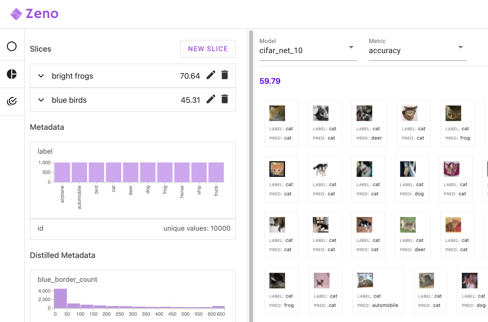

# ML Testing with Zeno

Zeno is an API and interface for evaluating machine learning models.
You first define how you expect a model to behave for subsets of data, and optionally after transformations.
The UI then allows you to explore and compare the results across models.

````{panels}
:card: border-2
Write simple `slicing` and `metric` functions:
^^^
```python
@slicer(["accuracy"])
def medium_sample(data, metad):
    return metad.sample(100).index

@metric
def accuracy(out, metad):
    return metad[
           metad["lab"] == out].shape[0]
           / (metad.shape[0]) * 100
```
---

Analyze & compare models with a powerful UI:
^^^



````

The tests are connected as follows. Slices are optionally passed to transforms, which are then passed to have metrics calculated.

```{image} flow.png
:alt: flow
:width: 500px
:align: center
```

## Quickstart

```bash
pip install zenoml
```

Create a folder with at least one Python file including a `load_model` and `load_data` function.
Add any number of Zeno modules, including the `preprocess`, `slicer`, and `metric` functions.
See [Writing Tests](writing_tests) for details on each of these modules.

Next, create a configuration `TOML` file with the required options such as metadata and model file paths. See [API](api) for the configuration options.

Lastly, run Zeno:

```bash
zeno config.toml
```

See [Test Examples](test-examples) for various example tests.

## Table of Contents

```{tableofcontents}

```
